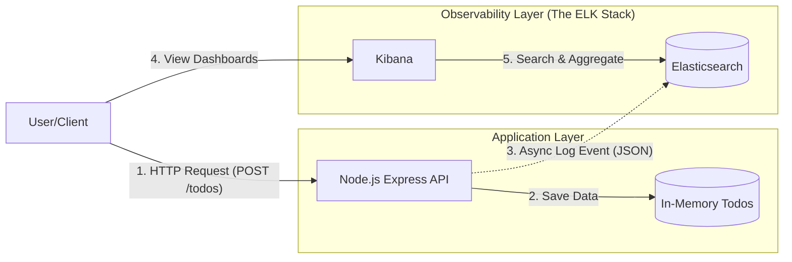

# Todo Observability Project using Elasticsearch & Kibana

Welcome to **todo-observability-elastic**! This is a hands-on learning project designed to teach you how to integrate **Elasticsearch** as a logging/observability backend for a Node.js application and visualize the data in **Kibana**.

## 🚀 Project Overview

This is a REST API for a Todo application. Unlike a standard app that just stores data, this app **logs every single event** (requests, errors, system events) to Elasticsearch.

**Key Features:**
- **Node.js + Express**: Core API
- **Elasticsearch**: Stores robust structured event logs
- **Kibana**: Visualizes traffic, errors, and performance
- **Docker Compose**: Orchestrates the Elastic Stack

---

## 📐 System Architecture (Beginner's Guide)

Understanding how the pieces fit together is crucial.

### High-Level Diagram



### 🔍 How Elasticsearch Works Here
Think of **Elasticsearch** not as a normal database, but as a **search engine** for your data.

1.  **The Index (`todo-events-YYYY.MM.DD`)**:
    *   Think of an **Index** like a **Table** in SQL or a **Collection** in MongoDB.
    *   We create a new index *every day* (e.g., `todo-events-2024.01.01`). This is a best practice for logging so you can delete old logs easily by just deleting the old index.

2.  **The Document**:
    *   Every time you hit the API, the app sends a **JSON Document** to Elasticsearch.
    *   Example Document:
        ```json
        {
          "actionType": "CREATE_TODO",
          "httpStatus": 201,
          "responseTimeMs": 12,
          "timestamp": "2024-02-17T10:00:00Z"
        }
        ```
    *   Elasticsearch "indexes" every field. You can instantly search for "all logs with `httpStatus` 400" and get results in milliseconds, even with millions of logs.

### 📊 The Role of Kibana
**Kibana** is your window into Elasticsearch. Elasticsearch has no UI; it just speaks JSON. Kibana provides the UI.

1.  **Data Views (Index Patterns)**:
    *   Since we have different indices for each day (`todo-events-2024.01.01`, `todo-events-2024.01.02`), Kibana needs a way to view them all at once.
    *   We create a **Data View** called `todo-events-*`. The `*` tells Kibana: "Look at all indices starting with `todo-events-`."

2.  **Discover Tab**:
    *   This is where you explore raw data. You can filter, read specific log lines, and debug issues.

3.  **Visualizations**:
    *   Kibana takes the data from Elasticsearch and turns it into Pie Charts (e.g., Error Rates), Bar Charts (Traffic over time), and Heatmaps.

---

## 🛠️ Prerequisites

- **Node.js** (v16+)
- **Docker** & **Docker Compose**
- **Git**

## 🏁 Setup & Installation

### 1. Start the Infrastructure
First, spin up Elasticsearch and Kibana using Docker.

```bash
docker-compose up -d
```
> ⏳ **Wait about 2-3 minutes** for the containers to fully start. Elasticsearch takes a moment to initialize.

**Verify Elasticsearch is running:**
```bash
curl http://localhost:9200
```
You should see a JSON response with `"tagline": "You Know, for Search"`.

### 2. Install Project Dependencies
Run this in the project root:
```bash
npm install
```

### 3. Start the API
```bash
npm run dev
```
The server will start at `http://localhost:3000`. You should see:
`✅ Elasticsearch connected: green`

### 4. Seed Data
Generate sample traffic (todos, updates, errors) to populate Elasticsearch:
```bash
npm run seed
```

---

## 📊 Kibana Learning Guide (Crucial Step)

Now strictly follow these steps to master Kibana.

### Step 1: Access Kibana
Open [http://localhost:5601](http://localhost:5601) in your browser.

### Step 2: Create a Data View
1. Go to **Stack Management** (bottom left cog icon) > **Data Views**.
2. Click **Create data view**.
3. Name: `Todo Events`
4. Index pattern: `todo-events-*` (This matches our daily indices like `todo-events-2024.10.15`).
5. Timestamp field: select `timestamp`.
6. Click **Save data view**.

### Step 3: Discover & Search
1. Click on the **Discover** icon (compass) in the left menu.
2. Ensure "Todo Events" is selected.
3. Adjust the time filter (top right) to **"Last 15 minutes"** or **"Today"**.
4. **Try these searches in the search bar (KQL - Kibana Query Language):**

   | Goal | KQL Query |
   | :--- | :--- |
   | **Find Errors** | `logLevel: "error"` |
   | **Slow Requests** | `responseTimeMs > 50` |
   | **Deletions** | `actionType: "DELETE_TODO"` |
   | **Specific User Agent** | `userAgent: *Mozilla*` |

### Step 4: Build a Dashboard (Visualizing Data)
1. Go to **Dashboard** > **Create dashboard**.
2. Click **Create visualization** (Lens).
3. **Build these Charts:**
   *   **Traffic Volume**: Drag `Records` to Vertical Axis, `timestamp` to Horizontal Axis. (Shows when your API is busy).
   *   **Success vs Error**: Drag `logLevel` to the center. Select "Donut" chart. (Quickly see health).
   *   **Action Distribution**: Drag `actionType` to the center. Select "Pie" chart. (See what users are doing).
   
---

## 🧠 Elasticsearch Index Mapping

This is the schema we use for our logs.

### Text vs. Keyword (Important Concept)
- **Keyword**: Used for EXACT filtering and aggregations.
    - *Example*: `status: "error"`.
    - *Use case*: "Show me a pie chart of all status codes."
- **Text**: Used for FULL-TEXT search (substrings, fuzzy matching).
    - *Example*: `errorMessage: "database connection timeout"`.
    - *Use case*: "Search for 'timeout'" -> finds "connection timeout".

**Our Mapping:**
```json
{
  "mappings": {
    "properties": {
      "eventId": { "type": "keyword" },
      "timestamp": { "type": "date" },
      "serviceName": { "type": "keyword" },
      "actionType": { "type": "keyword" },
      "logLevel": { "type": "keyword" },
      "responseTimeMs": { "type": "integer" },
      "httpStatus": { "type": "integer" },
      "endpoint": { "type": "keyword" },
      "method": { "type": "keyword" },
      "errorMessage": { "type": "text" }, // Searchable text
      "payloadSnapshot": { "type": "text" }
    }
  }
}
```

---

## 🔎 Elasticsearch Learning: Query DSL

You can run these via Kibana **Dev Tools** (Console) or `curl`. This is how you "talk" to Elasticsearch programmatically.

### 1. Search Last 10 Logs
```json
GET todo-events-*/_search
{
  "size": 10,
  "sort": [
    { "timestamp": "desc" }
  ]
}
```

### 2. Find Logs with specific Action
**Term Query** (Exact match):
```json
GET todo-events-*/_search
{
  "query": {
    "term": { "actionType": "CREATE_TODO" }
  }
}
```

### 3. Find Errors (Boolean Query)
```json
GET todo-events-*/_search
{
  "query": {
    "bool": {
      "must": [
        { "term": { "logLevel": "error" } }
      ]
    }
  }
}
```

### 4. Aggregations (Stats)
Count requests by Action Type:
```json
GET todo-events-*/_search
{
  "size": 0,
  "aggs": {
    "actions_count": {
      "terms": { "field": "actionType" }
    }
  }
}
```

---

## 📡 API Documentation

### Base URL: `http://localhost:3000/api`

| Method | Endpoint | Description |
| :--- | :--- | :--- |
| `POST` | `/todos` | Create a todo |
| `GET` | `/todos` | List all todos |
| `GET` | `/todos/:id` | Get todo details |
| `PUT` | `/todos/:id` | Update a todo |
| `DELETE` | `/todos/:id` | Delete a todo |
| `GET` | `/health` | System health check |

**Example Creation:**
```bash
curl -X POST http://localhost:3000/api/todos \
-H "Content-Type: application/json" \
-d '{"title": "Master Elasticsearch", "priority": "high"}'
```

---

## ❓ Troubleshooting

**Elasticsearch Connection Refused?**
- Ensure Docker containers are running: `docker ps`
- Ensure you waited a minute after starting docker-compose.
- Check logs: `docker logs todo-elastic`

**Kibana "No Indices Found"?**
- You must generate data first! Run `npm run seed`.
- Ensure your Data View pattern is `todo-events-*`.

**No Events appearing?**
- Check Node.js console for "Failed to send log" errors.
- Ensure `todo-events-*` index exists via Kibana Dev Tools: `GET _cat/indices`.

---
**Happy Logging!**
